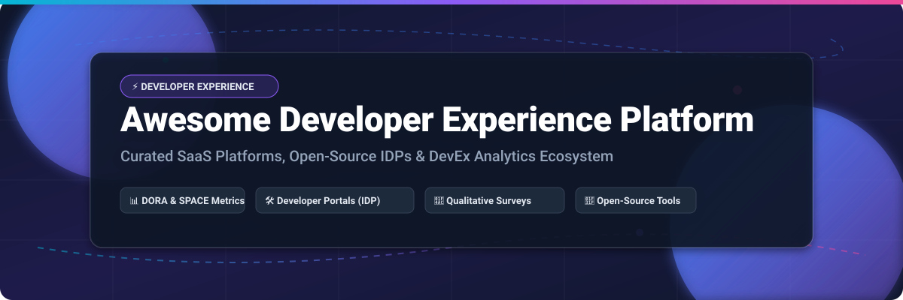
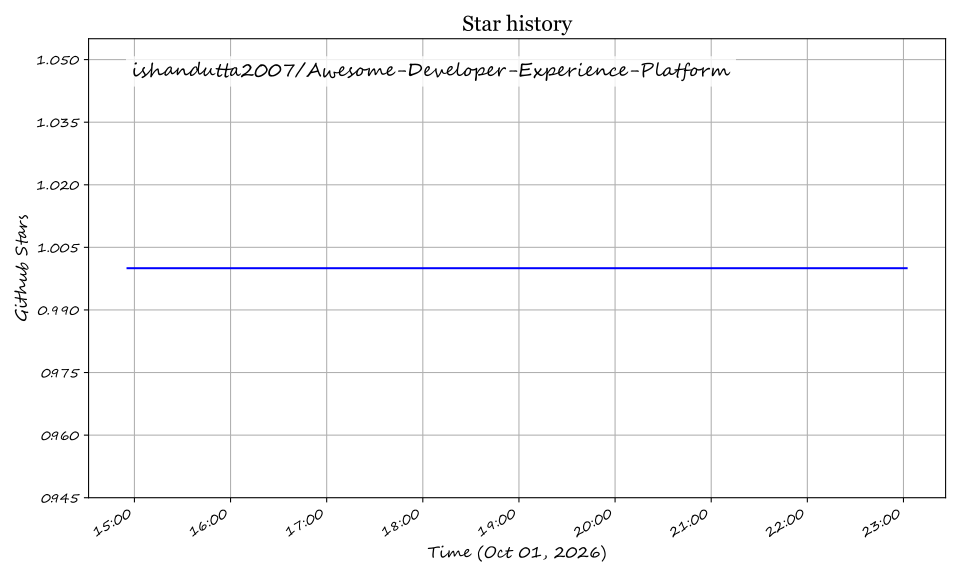

# 🚀 Awesome Developer Experience Platform (DevEx)

  
  
  
  
  

---

## 💡 Overview & Market Landscape

This curated awesome list tracks the top **SaaS platforms** and **open-source GitHub projects** dedicated to **Developer Experience (DevEx)**, **Developer Productivity Analytics**, **Internal Developer Portals (IDP)**, and **Software Delivery Intelligence (DORA / SPACE)**.

> 📊 **Estimated Market Size & Structure**: The Developer Experience & Productivity Platform market is estimated at **$1.8 Billion – $2.5 Billion** (as of 2026) with a projected CAGR of 22% towards $5B+ by 2030. The market structure is **moderately fragmented**, balancing enterprise software delivery platforms, specialized service catalog & IDP solutions, and research-backed qualitative developer survey tools.

---

## 📑 Table of Contents

- [🏢 SaaS & Hosted Platforms](#-saas--hosted-platforms)
- [🌟 Open-Source GitHub Projects](#-open-source-github-projects)
- [📊 DevEx Frameworks Comparison](#-devex-frameworks-comparison)
- [🤝 How to Contribute](#-how-to-contribute)
- [📈 Star History](#-star-history)
- [💖 Support & Sponsorship](#-support--sponsorship)
- [⚖️ Disclaimer](#%EF%B8%8F-disclaimer)

---

## 🏢 SaaS & Hosted Platforms

> 💡 *Below is a comparative breakdown of commercial SaaS DevEx solutions, sorted by **Company Size / Valuation & Scale** (descending).*

| Platform | Description & Key Focus | Starting Tier Pricing | Free Tier / Trial Limit | Company Size & Valuation |
| :--- | :--- | :--- | :--- | :--- |
| **[Harness IDP](https://www.harness.io/)** | Internal developer portal integrated with Harness software delivery platform, service catalogs, and automated software templates. | $25 / developer / month (IDP module / HSU model) | Free plan for up to 5 developers & 100 services (14-day trial on paid features) | **Mega Enterprise** (~$3.7B Valuation, $230M+ funding) |
| **[Jellyfish](https://jellyfish.co/)** | Enterprise engineering management platform positioning around business alignment, allocation tracking, and executive portfolio reporting. | $500 / developer / year (~$41.67 / dev / month) | 14-day custom POC / trial (no permanent free tier) | **Large Enterprise** (~$500M Valuation, $115M+ funding) |
| **[Cortex](https://www.cortex.io/)** | Service catalog & engineering intelligence platform with deep scorecards and Magellan AI catalog auditing assistant. | $65 / user / month (Standard plan estimate) | 14-day custom POC / demo pilot (no permanent free tier) | **Mid-Enterprise** (~$300M Valuation, $50M+ funding) |
| **[LinearB](https://linearb.io/)** | Engineering intelligence platform with PR cycle time optimization, WorkerB automation, AI Insights, and DevEx survey analytics. | $29 / contributor / month (Essentials plan) | Free forever for up to 8 contributors (14-day trial on paid features) | **Growth Stage** (~$200M Valuation, $71M+ funding) |
| **[Port](https://www.port.io/)** | Managed, API-first internal developer portal with customizable entity blueprints, self-service actions, and governance scorecards. | $30 / seat / month (Basic plan, billed annually) | Free forever for up to 15 active users (10,000 entities, 400 runs) | **Growth Stage** (~$150M–$200M Valuation, $53M+ funding) |
| **[Humanitec](https://humanitec.com/)** | Internal developer platform & environment orchestrator built around the open-source Score specification for automated environment provisioning. | $1,979 / month (Teams plan, covering ~5 users) | 30-day free trial (no permanent free tier) | **Growth Stage** (~$100M–$150M Valuation, $34M+ funding) |
| **[OpsLevel](https://www.opslevel.com/)** | Service catalog with automated service discovery, maturity scorecards, and developer self-service workflow automation. | $39 / developer / month (Standard plan estimate) | 14-day free trial (no permanent free tier) | **Growth Stage** (~$80M–$100M Valuation, $20M+ funding) |
| **[DX (getdx)](https://getdx.com/)** | Research-backed DevEx platform centered on the Developer Experience Index (DXI) and DX Core 4 framework (DORA + SPACE + DevEx). | ~$50–$65 / developer / month (starts at ~$21,000/year contract) | Custom POC / demo pilot (no standard free tier) | **Scale-Up** (~$50M–$100M Valuation, $18M+ funding) |
| **[Swarmia](https://www.swarmia.com/)** | Engineering effectiveness platform combining DORA metrics, developer satisfaction surveys, investment balance, and AI tool adoption. | $45 / developer / month (Standard plan) | Free forever for up to 10 developers (14-day trial for larger teams) | **Scale-Up** (~$50M–$70M Valuation, $14.5M funding) |
| **[Roadie](https://roadie.io/)** | Fully managed, SaaS Backstage internal developer portal with plugin integrations, catalog scorecards, and automated maintenance. | $24 / developer / month (Teams plan, 50–150 devs) | 45-day free trial (Free self-hosted Roadie Local for <15 users) | **Early Stage** (~$20M–$30M Valuation, $5M funding) |

---

## 🌟 Open-Source GitHub Projects

> 💡 *Open-source projects provide customizable developer data platforms, event standards, and workstation metrics. Sorted by **GitHub Stars_Count** (descending).*

- **[Spotify Backstage](https://github.com/backstage/backstage)**   
  CNCF incubating open-source platform for building internal developer portals (IDPs). Unified software catalog, software templates, and plugin ecosystem powered by a massive global community.

- **[Apache DevLake](https://github.com/apache/incubator-devlake)**   
  Open-source developer data platform that ingests, analyzes, and visualizes fragmented data from DevOps tools. Provides out-of-the-box DORA dashboards, Grafana integrations, and customizable SQL data schemas.

- **[Middleware](https://github.com/middlewarehq/middleware)**   
  Lightweight open-source engineering management and DORA metrics platform designed for agile engineering teams tracking cycle time and deployment frequency.

- **[Score Workload Specification](https://github.com/score-spec/score)**   
  Developer-centric, open-source workload specification that enables developers to define environment-agnostic workload requirements without needing complex infrastructure code.

- **[Faros AI Community Edition](https://github.com/faros-ai/faros-community-edition)**   
  Open-source engineering operational data platform connecting engineering operations data across SCM, CI/CD, issue trackers, and HR systems into a single GraphQL API.

- **[CDEvents Specification](https://github.com/cdevents/spec)**   
  Open standard specification for CloudNative Events in Continuous Delivery (Continuous Integration & Delivery events), enabling interoperable measurement across build pipelines.

- **[CDviz](https://github.com/cdviz/cdviz)**   
  Open-source event-driven pipeline observability and DORA metrics platform built on top of the CDEvents standard.

- **[java-local-metrics (Agoda)](https://github.com/agoda-com/java-local-metrics)**   
  Open-source Java library measuring local developer workstation build and test execution performance (the **F5 Experience**).

- **[DevEx Resources](https://github.com/shaharia-lab/devex-resources)**   
  Curated resource collection covering Developer Experience research papers, framework specifications, DORA metrics, and SPACE guidelines.

- **[Awesome Developer Experience](https://github.com/prokopsimek/awesome-developer-experience)**   
  Curated index of DX tooling, API design standards, knowledge bases, and local development environments.

---

## 📊 DevEx Frameworks Comparison

| Framework | Core Focus | Key Metrics Measured | Best Suited For |
| :--- | :--- | :--- | :--- |
| **DORA Metrics** | Quantitative DevOps Delivery | Lead Time for Changes, Deployment Frequency, Change Failure Rate, MTTR | CI/CD & Pipeline Velocity |
| **SPACE Framework** | Holistic Productivity | Satisfaction, Performance, Activity, Communication, Efficiency | Cross-functional Engineering Management |
| **DXI (DX Core 4)** | Developer Satisfaction & Flow | Speed, Effectiveness, Quality, Impact & Perception Surveys | Research-backed DevEx Organizations |

---

## 🤝 How to Contribute

Contributions are welcome! Please follow these guidelines:
1. Check the existing entries to avoid duplicates.
2. Open a Pull Request with factual descriptions, specific pricing references, and official links.
3. Check out the main awesome list collection at [Awesome-Awesome-Awesome](https://github.com/ishandutta2007/Awesome-Awesome-Awesome).

---

## 📈 Star History

---

## 💖 Support & Sponsorship

If you find this repository helpful for evaluating DevEx platforms, please consider giving it a star 🌟, sharing it with your engineering team, or supporting further development!

- ⭐️ **Star & Fork** this repo to help others discover top DevEx tools.
- 💬 **Join the Discussion** on our [Discord Community](https://discord.gg/jc4xtF58Ve).
- ☕ **Sponsor / Buy a Coffee**: Support ongoing maintenance via the [GitHub Sponsors Dashboard](https://github.com/sponsors/ishandutta2007).

  

---

## ⚖️ Disclaimer

*This project is curated for educational and comparison purposes. Product names, logos, and trademarks belong to their respective owners. Pricing data is based on public disclosures and industry benchmark estimates as of 2026.*

## Star History

<a href="https://star-history.com/#ishandutta2007/Awesome-Developer-Experience-Platform&Timeline" align="center">
  <picture>
    <source media="(prefers-color-scheme: dark)" srcset="assets/ishandutta2007_Awesome-Developer-Experience-Platform_growth.svg">
    
  </picture>
</a>
